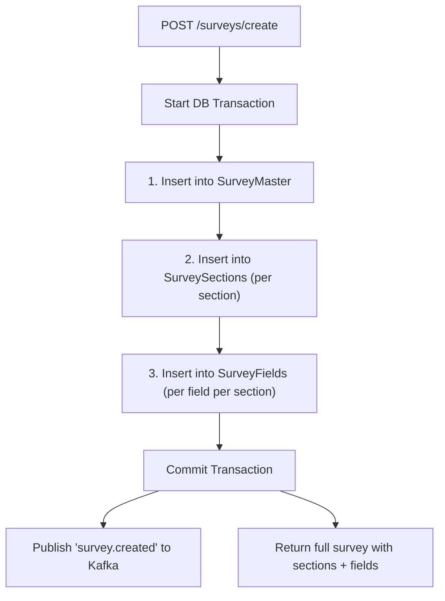
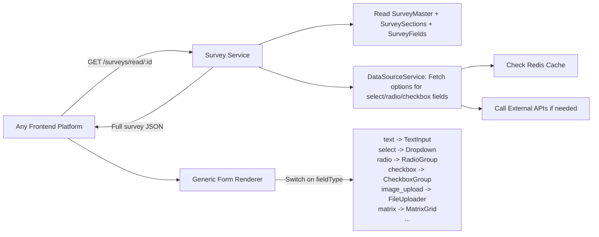
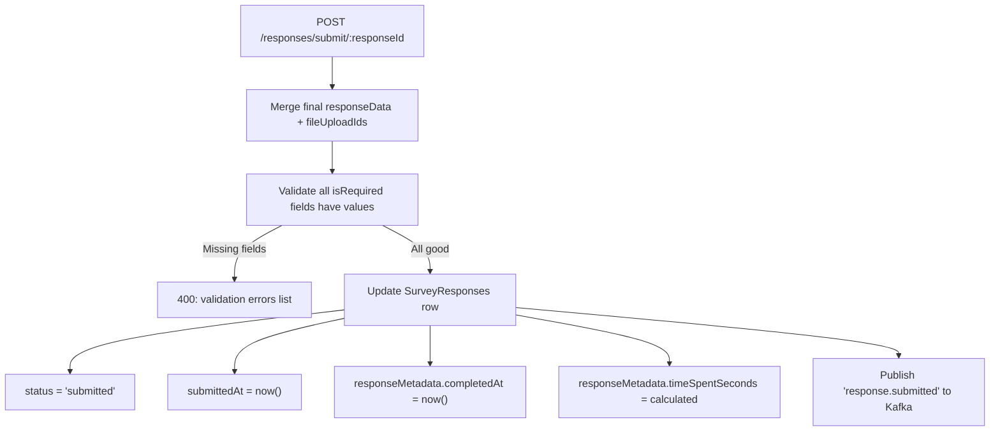
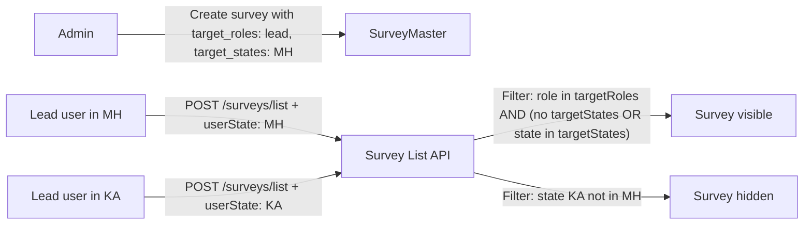
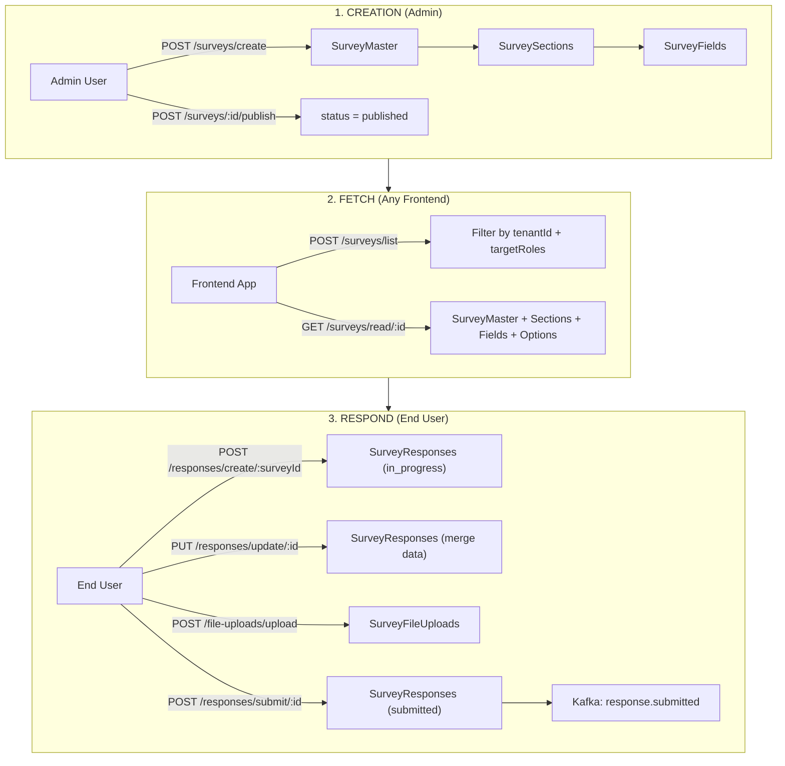

# Survey End-to-End Flow: Create, Fetch, Submit

---

## Current Database Tables (4 tables)


| Entity             | Table Name          | Purpose                                                                     |
| ------------------ | ------------------- | --------------------------------------------------------------------------- |
| `Survey`           | `SurveyMaster`      | Top-level survey definition (title, status, who can fill, context type)     |
| `SurveySection`    | `SurveySections`    | Logical groupings of fields within a survey (ordered)                       |
| `SurveyField`      | `SurveyFields`      | Individual questions/inputs (type, validations, data source, upload config) |
| `SurveyResponse`   | `SurveyResponses`   | Filled responses (all answers stored as JSONB)                              |
| `SurveyFileUpload` | `SurveyFileUploads` | Uploaded media files linked to responses                                    |


---

## PHASE 1: Survey Creation (Admin/Backend)

**API:** `POST /api/v1/surveys/create`
**Headers:** `Authorization: Bearer <token>`, `tenantid: <uuid>`

### What happens in the backend (single DB transaction):




### Table writes during creation:

**Step 1 - `SurveyMaster`** (1 row)

- `surveyId` (auto-generated UUID)
- `tenantId` (from header)
- `surveyTitle`, `surveyDescription`, `surveyType`
- `status` = `'draft'` (always starts as draft)
- `targetRoles` (JSONB array, e.g. `["teacher", "team_leader"]`) -- controls WHO sees this survey
- `contextType` (e.g. `'learner'`, `'center'`, `'self'`, `'none'`) -- controls WHAT entity responses are filled against
- `settings` (JSONB -- `allowMultipleSubmissions`, etc.)
- `theme` (JSONB -- UI theming)
- `createdBy`, `updatedBy` (user UUID from token)

**Step 2 - `SurveySections`** (N rows, one per section)

- `sectionId` (auto UUID)
- `surveyId` (FK to SurveyMaster)
- `tenantId`
- `sectionTitle`, `sectionDescription`
- `displayOrder` (integer for ordering)
- `isVisible`, `conditionalLogic` (JSONB for show/hide rules)

**Step 3 - `SurveyFields`** (M rows per section)

- `fieldId` (auto UUID)
- `sectionId` (FK to SurveySections)
- `surveyId` (denormalized FK to SurveyMaster for fast queries)
- `tenantId`
- `fieldName`, `fieldLabel`
- `fieldType` (one of 20 types: `text`, `select`, `radio`, `checkbox`, `rating`, `image_upload`, `matrix`, etc.)
- `isRequired`, `displayOrder`
- `placeholder`, `helpText`, `defaultValue`
- `validations` (JSONB -- min/max length, regex patterns, etc.)
- `dataSource` (JSONB -- where dropdown/radio options come from; see "Making It Generic" below)
- `uploadConfig` (JSONB -- max size, allowed types for file/image/video fields)
- `uiConfig` (JSONB -- layout hints, column span, etc.)
- `conditionalLogic` (JSONB -- show/hide based on other field answers)

### After creation, Admin must PUBLISH:

**API:** `POST /api/v1/surveys/:surveyId/publish`

- Validates: survey has at least 1 section with at least 1 field
- Sets `status = 'published'`, `publishedAt = now()`
- Only published surveys can accept responses

---

## PHASE 2: How Frontend (Any Platform) Fetches a Survey

### Step 2a: Get list of surveys for the logged-in user

**API:** `POST /api/v1/surveys/list`
**Headers:** `Authorization: Bearer <token>`, `tenantid: <uuid>`
**Body:** `{ "page": 1, "limit": 20 }`

The backend automatically filters by:

- `tenantId` (from header)
- `targetRoles`: if user is NOT admin, only surveys whose `targetRoles` JSONB array contains at least one of the user's roles are returned (PostgreSQL `?|` operator). If `targetRoles` is NULL, visible to all.

**This is what makes it generic across 7 platforms:** each platform's users have different roles. The survey's `targetRoles` array controls visibility. No platform-specific code needed.

### Step 2b: Get full survey form (structure + fields)

**API:** `GET /api/v1/surveys/read/:surveyId`
**Headers:** `Authorization: Bearer <token>`, `tenantid: <uuid>`

**Returns:** The complete survey tree:

```
{
  surveyId, surveyTitle, surveyDescription, status, contextType, settings, theme,
  sections: [
    {
      sectionId, sectionTitle, displayOrder, isVisible, conditionalLogic,
      fields: [
        {
          fieldId, fieldName, fieldLabel, fieldType, isRequired, displayOrder,
          placeholder, helpText, defaultValue, validations,
          dataSource, options,   // <-- options populated at runtime from dataSource
          uploadConfig, uiConfig, conditionalLogic
        }
      ]
    }
  ]
}
```

**Key: Dynamic option population.** When `dataSource` is configured on a field, the backend's [DataSourceService](src/modules/survey/services/data-source.service.ts) fetches options at read time:

- `type: "static"` -- options are inline in the `dataSource.options` array
- `type: "api"` -- calls an external HTTP endpoint, maps the response using `mapping.valueField` / `mapping.labelField`, caches in Redis
- `type: "internal_api"` -- calls another internal microservice
- Results are injected as a transient `options` array on the field (not persisted)

### How the frontend renders generically:




The frontend reads `fieldType` and renders the appropriate component. The `validations`, `uiConfig`, `conditionalLogic` drive behavior. **No platform-specific survey logic needed** -- the survey definition IS the configuration.

---

## PHASE 3: Submitting Responses (Where Data Goes)

### Step 3a: Start a response

**API:** `POST /api/v1/responses/create/:surveyId`
**Body:**

```json
{
  "contextId": "learner-uuid-001"  // required if survey.contextType != 'none'/'self'
}
```

**Writes to `SurveyResponses`** (1 row):

- `responseId` (auto UUID)
- `tenantId`, `surveyId`, `respondentId` (from token)
- `contextType` (copied from survey), `contextId` (from body)
- `status = 'in_progress'`
- `responseData = {}` (empty initially)
- `responseMetadata = { startedAt: "..." }`

### Step 3b: Save progress (partial saves)

**API:** `PUT /api/v1/responses/update/:responseId`
**Body:**

```json
{
  "responseData": { "<fieldId>": "answer value", "<fieldId2>": ["opt1", "opt2"] },
  "fileUploadIds": { "<fieldId>": ["fileId1", "fileId2"] }
}
```

**Updates `SurveyResponses`:**

- Merges `responseData` (JSONB shallow merge)
- Merges `fileUploadIds`
- Publishes `response.updated` to Kafka

### Step 3c: Final submission

**API:** `POST /api/v1/responses/submit/:responseId`
**Body:** (optional final data)

```json
{
  "responseData": { "<fieldId>": "final answer" },
  "fileUploadIds": { "<fieldId>": ["fileId"] }
}
```

**What happens:**




**Tables written on submit:**

- `SurveyResponses` -- the single row is updated with final data + status change
- `SurveyFileUploads` -- already written during upload (separate file upload API), linked via `fileUploadIds` JSONB

### Step 3d: File uploads (during response)

**API:** `POST /api/v1/file-uploads/upload`
**Writes to `SurveyFileUploads`** (1 row per file):

- `fileId`, `tenantId`, `surveyId`, `responseId`, `fieldId`
- `originalFilename`, `storedFilename`, `filePath` (MinIO/S3 path)
- `fileSize`, `mimeType`, `fileType` (image/video)
- Image metadata: `imageWidth`, `imageHeight`, `imageThumbnailPath`
- Video metadata: `videoDuration`, `videoThumbnailPath`

---

## Making It Generic for 7 Platforms -- Summary

The system is **already platform-agnostic** by design. Here is how the genericness works:

- `**tenantId`** (header) -- isolates data per tenant/deployment. Each of the 7 platforms can be a separate tenant, or share a tenant.
- `**targetRoles`** (JSONB on SurveyMaster) -- controls which user roles see which surveys. Platform A's "teacher" role sees teacher surveys; Platform B's "coordinator" role sees coordinator surveys. No code change needed.
- `**contextType`** (enum on SurveyMaster) -- defines what entity the survey is filled against (`learner`, `center`, `teacher`, `self`, `none`). The frontend passes the `contextId` when starting a response.
- `**dataSource`** (JSONB on SurveyFields) -- dropdown/radio options can come from any API, making the same survey form pull platform-specific data (e.g., learner lists from Platform A's API, center lists from Platform B's API).
- `**settings**` / `**theme**` / `**uiConfig**` (JSONB) -- per-survey and per-field UI customization without schema changes.
- `**fieldType**` enum (20 types) -- the frontend builds a component map; adding a new type requires only a new renderer component and an enum value.

**No platform-specific tables or code.** The entire configuration lives in JSONB columns, making the schema stable across all platforms.

---

## Geographical assignment (e.g. "Only show in state MH for lead roles")

**Current state:** There is no geography/state-based visibility in the survey service. Visibility is today driven only by `tenantId` and `targetRoles`.

**Requirement:** Restrict survey visibility by geography — e.g. show a survey only to users in state **MH** (Maharashtra) and only for **lead** roles.

### Recommended approach

**1. Store target geography on the survey**

- Add a **targetStates** (or **targetGeography**) concept on `SurveyMaster`:
  - **Option A (recommended):** New column `targetStates` (JSONB, nullable), e.g. `["MH"]`. `null` or `[]` = show in all states.
  - **Option B:** Put inside existing `settings`, e.g. `settings.targetStates = ["MH"]`. No schema change; slightly harder to index/query.
- At creation/update, admin sets e.g. `target_roles: ["lead"]` and `target_states: ["MH"]`.

**2. Pass user's geography when listing surveys**

- The survey service does **not** know the user's state; it only has `tenantId` and roles (from JWT). So the **frontend** must send the user's geography:
  - **Option A:** Extend list request body with optional `userState: "MH"` (or `userGeography: { state: "MH" }` for future district/city).
  - **Option B:** Optional header e.g. `x-user-state: MH`. Same idea, different transport.
- Frontend gets the user's state from wherever it already has it (user service, profile API, or JWT custom claim if auth service adds it).

**3. List API filter logic**

- In [survey.service.ts](src/modules/survey/services/survey.service.ts) `findAll()`:
  - Keep existing filter: (admin sees all) OR (survey.`targetRoles` is null OR user's role in survey.`targetRoles`).
  - **Add:** If the request includes `userState` (or equivalent), then additionally: show survey only if survey.`targetStates` is null/empty OR `userState` is in survey.`targetStates`.
- Result: "Only show in state MH for lead roles" = survey has `targetRoles: ["lead"]` and `targetStates: ["MH"]`. A lead user with `userState: "MH"` sees it; a lead user with `userState: "KA"` does not.

### Flow summary



### Tables / DTOs to touch

- **SurveyMaster:** Add column `targetStates` (JSONB, nullable), or document use of `settings.targetStates`.
- **CreateSurveyDto / UpdateSurveyDto:** Add optional `target_states?: string[]`.
- **PaginationDto (or list body):** Add optional `userState?: string` (or `userGeography?: { state?: string }` for future flexibility).
- **SurveyService.findAll():** Accept optional user geography; add AND condition when both `targetStates` and `userState` are present.

### Frontend (FT) responsibility

- When calling `POST /api/v1/surveys/list`, include the current user's state (e.g. from user/profile service or JWT) in the request body (or header) so the backend can filter by geography. If not sent, behaviour can remain "show all" (no geography filter) for backward compatibility.

---

## Complete Data Flow Diagram




